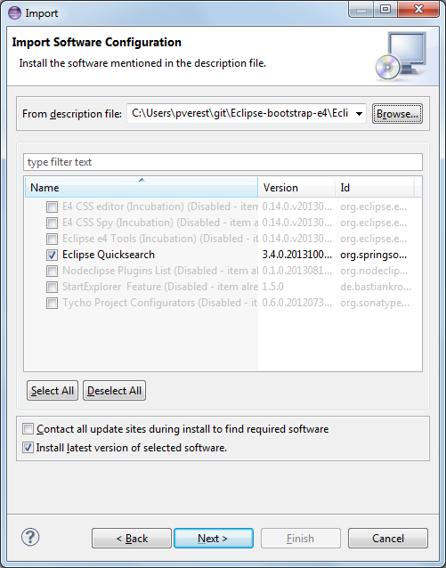

Eclipse-bootstrap-e4
====================

Quickly prepare Eclipse for e4 development with Maven/Tycho and other tools

Enide - Eclipse bootstrap e4, includes:

- Eclipse 4 Tools: Application Model Editor 
- Eclipse 4 Tools: CSS Spy 
- Eclipse 4 Tools: Lightweight CSS Editor 
- Nodeclipse Plugins List
- Eclipse Quicksearch (Ctrl+Shift+L)
- Tycho Project Configurators (Standard Eclipse will download m2e, if you don't have)
- StartExplorer

